# CSCD58 Final Project Report

## Project Goals

As we stated in our proposal, we intially planned to 

* support http 1.0 + 1.1 and pipelining;
* serve multiple types of files from the host machine, including .html, .css, .js, .txt, and .jpg;
* support conditional Get requests (If-Modified-Since Request)
* support http 2 over TCP if time allows.

We managed to accomplished the first two. Thus this is a HTTP server can serve the files over HTTP/1.0 or 1.1 protocol.
When choosing the HTTP/1.1, the server is capable to handle persistent connections and HTTP pipelining.

[](https://developer.mozilla.org/en-US/docs/Web/HTTP/Connection_management_in_HTTP_1.x)

> Source: [MDN Web doc](https://developer.mozilla.org/en-US/docs/Web/HTTP/Connection_management_in_HTTP_1.x)

The Project is implemented in [Golang](https://go.dev/), one of C family language and with great built-in concurrency and third-party modules management support.

## Project Implementation and Documentation

### Project Sturcture

The structure of the project is as below.

The entry of point the server or main program is under `/cmd/http1_server/`.

The packages in `/pkg` directory contain the logics including:

* `/pkg/config`: Utils to load configurations for server from yaml file;
* `/pkg/fsService`: Support services to help manipulate file in the host machines;
* `/pkg/httpParser`: Help convert between raw HTTP message to Go objects
* `/pkg/httpProto`: Store the const data such as HTTP status code, text and HTTP version text;
* `/pkg/router`: The handler logics for handling incomming HTTP request;
* `/pkg/server`: API to create a new Server instance and run it.

```shell
$ tree .
.
├── Makefile
├── cmd
│   └── http1_server
│       └── main.go
├── pkg
│   ├── config
│   │   └── config.go
│   ├── fsService
│   │   └── fsService.go
│   ├── httpParser
│   │   ├── requestParser.go
│   │   └── responseParser.go
│   ├── httpProto
│   │   └── httpProto.go
│   ├── router
│   │   └── router.go
│   └── server
│       └── sever.go
├── go.mod
├── go.sum
├── main
├── mainconfig.yml
```

For more details of each methods and struct, please refer the doc in each of *.go file

### Server Work Flow

The work flow of the server can be illustrated as below:

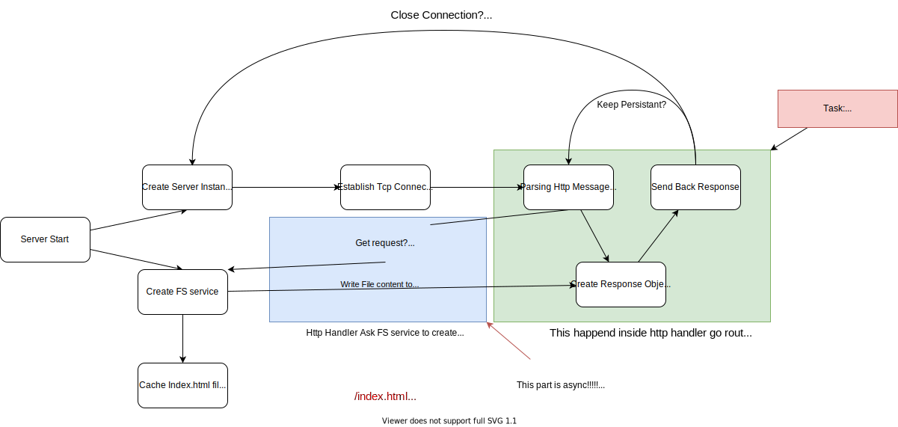

During the server running, there will be one server instance created and listenning to the new TCP connections. Everytime server received a new TCP connection, server will create a go routine or a new thread for the hanlder until the connections reach the max concurrent connection number.

```go
for {

    c, err := s.Listener.Accept()
    if err != nil {
			select {
			// Listner closed and got shutdown signal
			case <-s.quit:
                // break the listener loop
				return
			default:
				log.Println("accept error", err)
				continue
			}
		}

    // New Connection, now increase wait group by 1
    s.Wg.Add(1)

    // New Go routing to hanlde this connection
    go func() {
        router.SimpleHandler(s.quit, c, s.fs, s.config)
        s.Wg.Done()
    }()
}
```

> code snippet for server to listen and handle TCP connections

After the handler go routine started, handler will read HTTP requests from the TCP connection and handle the connection depending on HTTP version and if enabling persistant conntion & pipelining or not:

* If using HTTP/1.0 or HTTP/1.1 without persistant conntion, handler will only read request **once** from the TCP connection and write response **once** to the connection, then this connection will be closed. As for determing the MIME type of the file, we used a convinient library [mimetype](https://github.com/gabriel-vasile/mimetype) to do the detection, which can handle .html, .css, .js, .txt, .jpg and [more](https://github.com/gabriel-vasile/mimetype/blob/master/supported_mimes.md);

* If using HTTP/1.0 with persistant conntion, handler will read first request (stop readding when reaching an empty line `\r\n` ) from the TCP connection and write a response to, then wait for next request until reaching timeout or client decides to close the connection;

* If using HTTP/1.0 with persistant conntion and pipelining, server will try to read entire incoming TCP packet and parse multiple HTTP requets from it, then send back reponse for each of request got parsed. After all response are sent, this connection will wait for next requests until reaching timeout or client decides to close the connection.

When it's time to shutdown the server, server will stop listening new TCP connection and signal all running hanlder go rutines to close its TCP connection and returns. After all hanlders returned, server will stop binding the port and exit.

## Work Contribution

- Jiasong
  - Full implementation of `main.go`
  - Created skeleton of  `router.go`.
  - Full implementation of `server.go`
  - Created configuration loading utils: `mainconfig.yml`, `config.go`.
  - Full implementation `fsService.go` 
  - Implementation of `httpProto.go` (http protocol part)
  - Helped in debugging the `router.go` and the `requestParser.go`
  - Designed workflow
  - Created Makefile
- Cheng
  - Full implementation of `requestParser.go`
  - Full implementation of `responseParser.go`
  - Implementation of `httpProto.go` (response status code and text parts)
  - Major implementation of `router.go`

## Setup And Running

### Prerequisite

Download and Install [Golang](https://go.dev/dl/)

### Compile

Under root of project repo, run:

```shell
$ make
```

It will create a folder `bin` and an executable file `http1_server` inside it.

### Configuration

Here is the config yaml file, you can change the configuration to test server's performance and features

```yaml
Server:
  SERVER_PORT: 8080
  SERVER_HOST: "127.0.0.1"
  HTTP_VERSION: "HTTP/1.1"

RunTime:
  MAX_CONCURRENT_CONNECTIONS: 1024
  ENABLE_PESISTANT: True
  ENABLE_PIPELINING: True
  MAX_PIPELINING_NUMBER: 10
  TIMEOUT_DURATION: 10
```

There is also a sample yaml config file `mainconfig.yml` at the root of the repo you could use.

### Run

```shell
$ ./bin/http1_server <./path_to_mainconfig.yml>
```


## Implementation Testing

### HTTP SERVER 1.0

To test conditional GET requests, we used [this repo](https://github.com/cloudacademy/static-website-example) as our test folder to performance various testing cases.

#### Index.html is present in directory

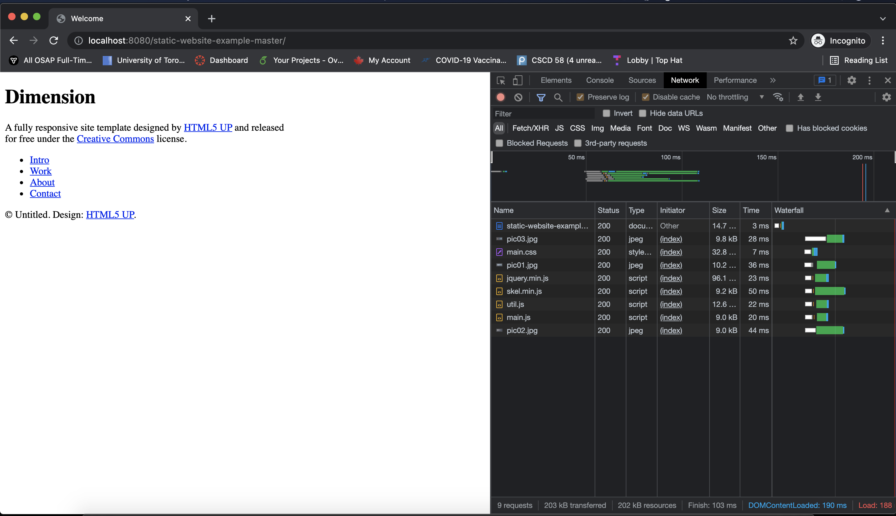

#### Index.html is NOT present in directory

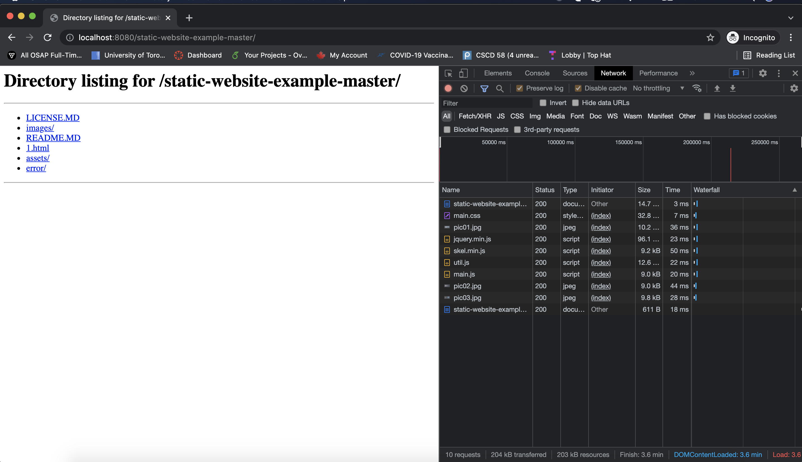

#### If-Modified-Since Request

Below is the last modification date of the request source which is Dec. 6, 2021, 7:46 PM

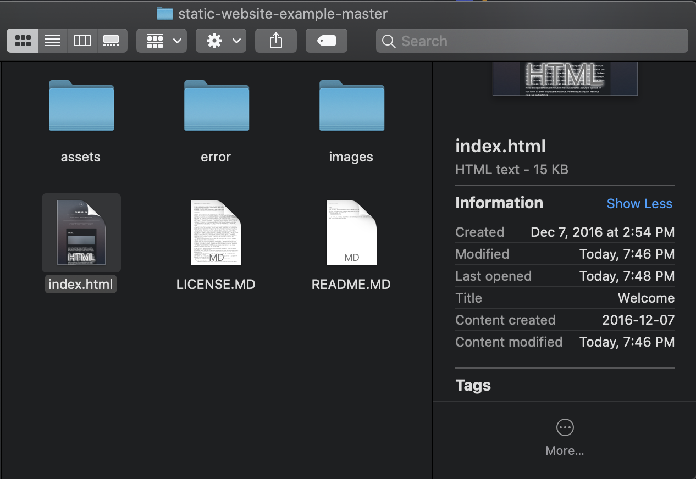

Here is the result, we see that the server correctly return 304 status code if "If-Modified-Since" is after the last modification date. Otherwise, it returns the updated content

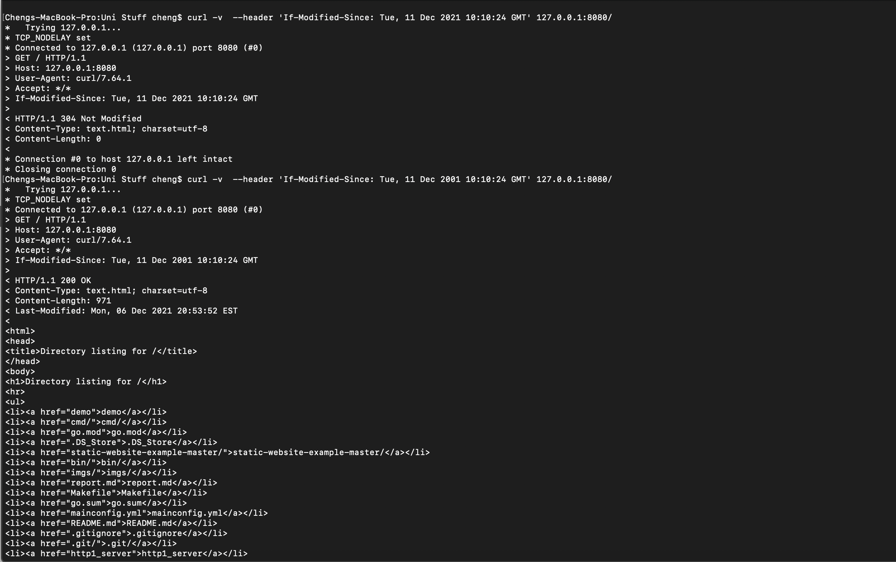

#### GET various file types

Markdown:

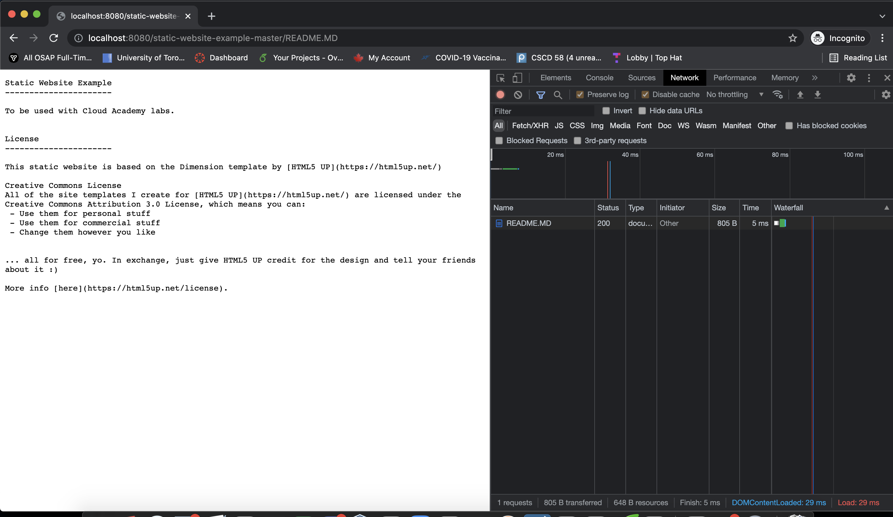

JPG:

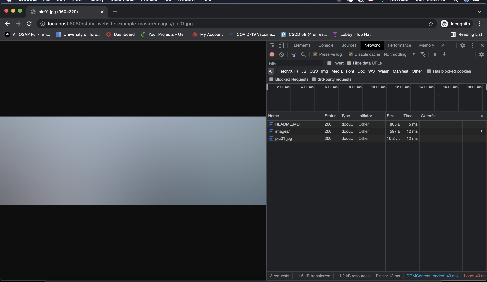

PNG: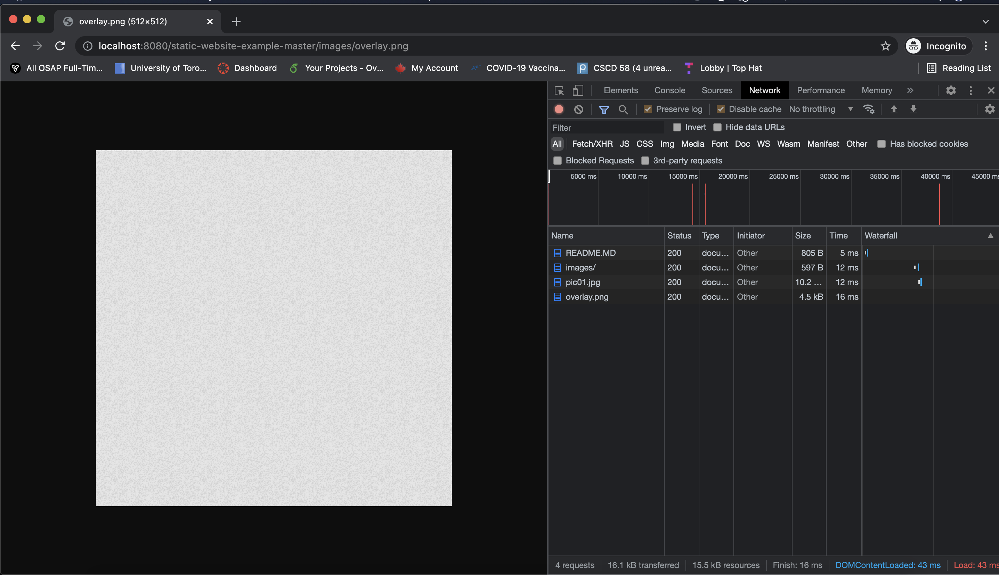

CSS:

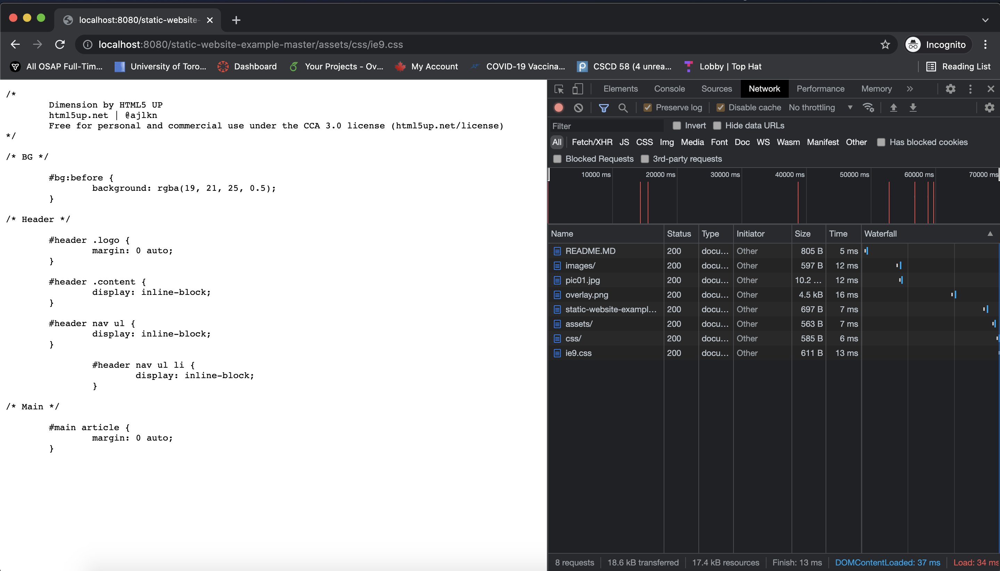

JS:

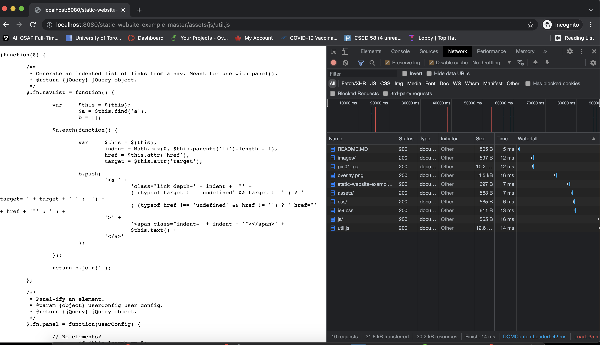


#### Send any request other than GET

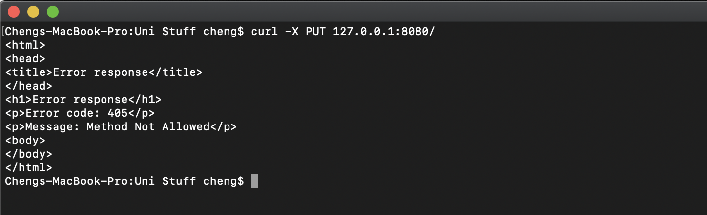

### HTTP SERVER 1.1 With Persistence

We can see from the first request is sent with header "Connection: keep-alive" so the second request reuses connection #0 without establishing a new connection.

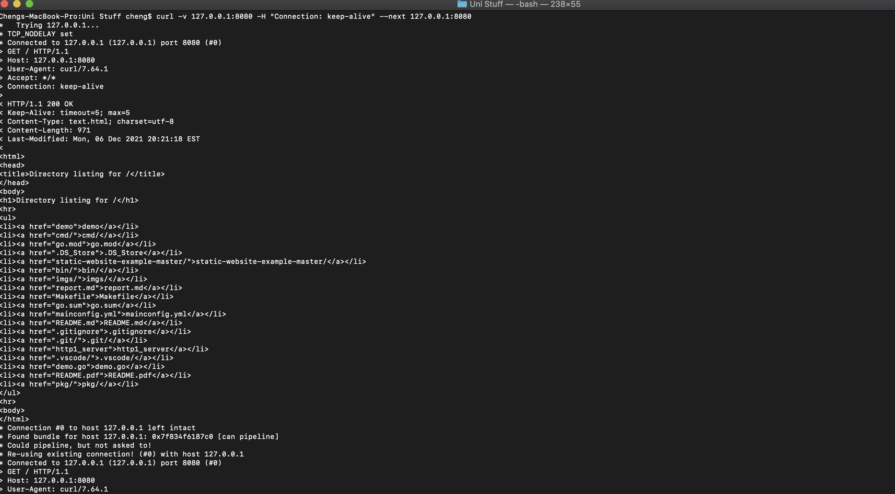

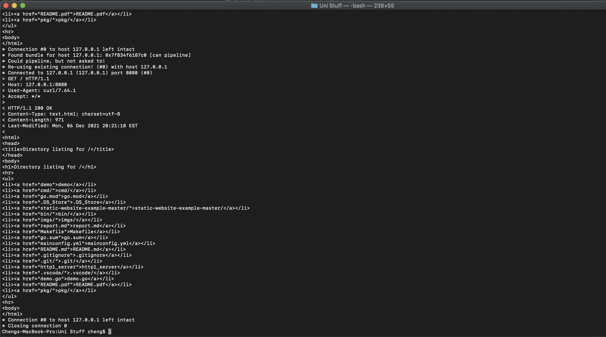

### HTTP SERVER 1.1 With Pipeline

Here we sent two GET request at once and the server returns two response at the same time.

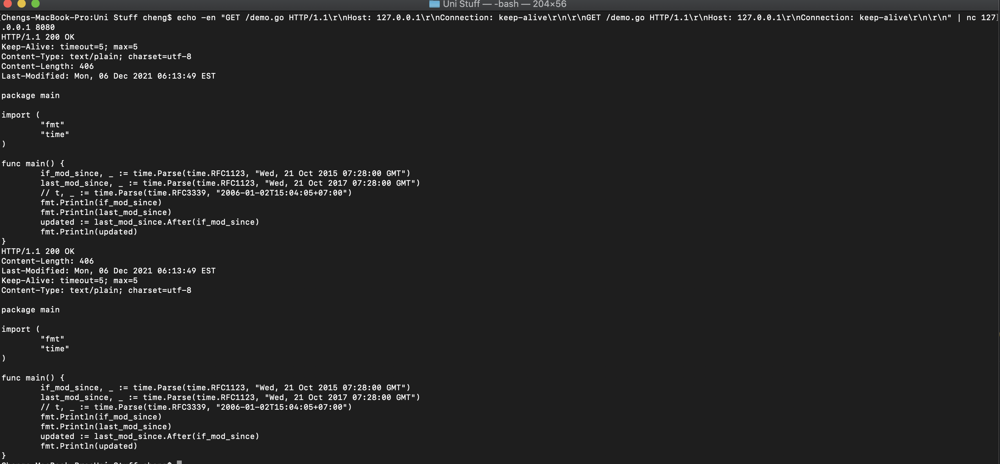

