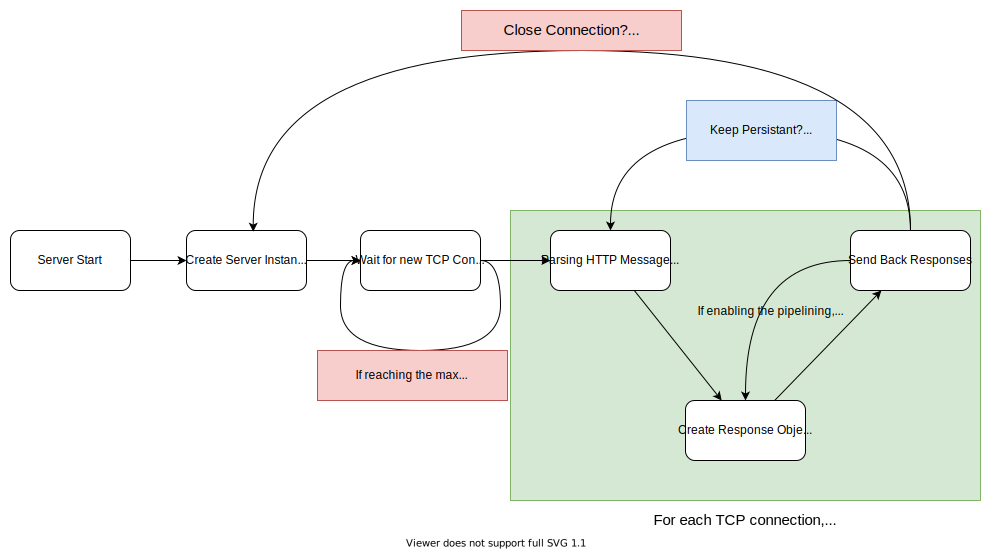

# CSCD58 Final Project Report

## Project Goals

As we stated in our proposal, we intially planned to 

* support http 1.0 + 1.1 and pipelining;
* serve multiple types of files from the host machine, including .html, .css, .js, .txt, and .jpg;
* support http 2 over TCP if time allows.

We managed to accomplished the first two. Thus this is a HTTP server can serve the files over HTTP/1.0 or 1.1 protocol.
When choosing the HTTP/1.1, the server is capable to handle persistent connections and HTTP pipelining.

[](https://developer.mozilla.org/en-US/docs/Web/HTTP/Connection_management_in_HTTP_1.x)

> Source: [MDN Web doc](https://developer.mozilla.org/en-US/docs/Web/HTTP/Connection_management_in_HTTP_1.x)

The Project is implemented in [Golang](https://go.dev/), one of C family language and with great built-in concurrency and third-party modules management support.

## Project Implementation and Documentation

The structure of the project is as below.
The entry of point the server or main program is under `/cmd/http1_server/`.
The packages in `/pkg` directory contain the logics including:

* `/pkg/config`: The codes used to load configurations for server from yaml file;
* `/pkg/fsService`: Support services to help manipulate file in the host machines;
* `/pkg/httpParser`: Help convert between raw HTTP message to Go objects
* `/pkg/httpProto`: Store the const data such as HTTP status code, text and HTTP version text;
* `/pkg/router`: The handler logics for handling incomming HTTP request;
* `/pkg/server`: API to create a new Server instance and run it.

```shell
$ tree .
.
├── Makefile
├── cmd
│   └── http1_server
│       └── main.go
├── pkg
│   ├── config
│   │   └── config.go
│   ├── fsService
│   │   └── fsService.go
│   ├── httpParser
│   │   ├── requestParser.go
│   │   └── responseParser.go
│   ├── httpProto
│   │   └── httpProto.go
│   ├── router
│   │   └── router.go
│   └── server
│       └── sever.go
├── go.mod
├── go.sum
├── main
├── mainconfig.yml
```

For more details of each methods and struct, please refer the doc in each of *.go file

The work flow of the server can be illustrated as below:


